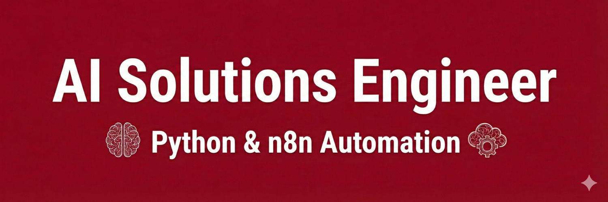

# Hi, I'm Fawad. 👋
### AI Solutions Engineer | Computer Vision | RAG Agents

---

### 🚀 **About Me**
I bridge the gap between **heavy-code AI** (Computer Vision, RAG) and **low-code speed** (n8n).
I don't just write scripts; I architect **self-healing automation systems** that replace manual enterprise workflows.

- 🔭 **Currently working on:** A Multimodal RAG Agent for medical research (MedBox).
- 💼 **Speciality:** Building "Agentic Workflows" and deploying Deep Learning models.
- 🎓 **Education:** B.S. Computer Science (2024–2027).

---

### 🛠 **Tech Stack**

**Core & Backend:**

**AI & Computer Vision:**

**Data & Scraping:**

---

### 🏆 **Featured Projects**

#### 1. **[Seedswild: AI Plant Disease Detection (Computer Vision)](https://github.com/Gh0st-047/Seedswild-rec-model)**
*An industrial-grade Deep Learning model for agricultural health.*
- **Problem:** Manual crop inspection was slow and error-prone.
- **Solution:** Trained a **CNN (Convolutional Neural Network)** on 50,000+ images to detect leaf diseases instantly.
- **Outcome:** Achieved **90% validation accuracy** and deployed the model for real-time inference.
- **Tech:** Python, TensorFlow, OpenCV.

#### 2. **[MedBox: AI Medical Researcher (RAG)](https://github.com/Gh0st-047/AI-Health-RAG-AGENT)**
*A "Super-Researcher" agent that indexes 1,000+ medical textbooks.*
- **Architecture:** Built with **LangChain** and **Vector Databases** to retrieve factual medical citations.
- **Key Feature:** Eliminates hallucinations by grounding answers in verified PDFs.
- **Tech:** Python, OpenAI API, Pinecone.

#### 3. **[Kickstarter & Social Scraper Pipeline](https://github.com/Gh0st-047/KickStarter-Scraper)**
*An anti-fragile scraping engine for Lead Gen Agencies.*
- **Solution:** Engineered a **Selenium** pipeline with residential proxies and human-mimicry logic to bypass Cloudflare.
- **Outcome:** Extracts 8,000+ leads daily with 99% success rate.

#### 4. **[n8n Payroll Automation Engine]()**
*Complex logic handling inside a low-code environment.*
- **Logic:** Custom **Python Nodes** inside n8n to parse messy Excel commission reports.
- **Result:** Reduced a 4-hour weekly manual task to a 30-second background process.

---

### 📊 **GitHub Stats**

---

   
  <b>Ready to automate your business?</b> 
  <a href="https://www.upwork.com/freelancers/~0107104c8b4fc4b224?viewMode=1">Hire Me on Upwork</a>

